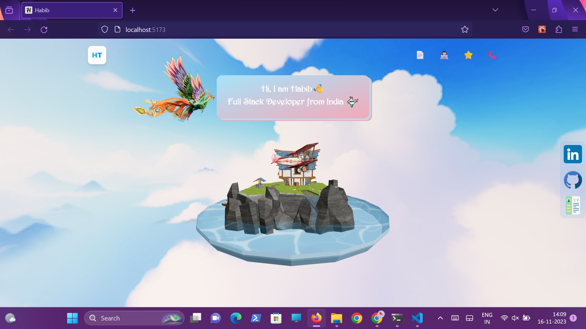
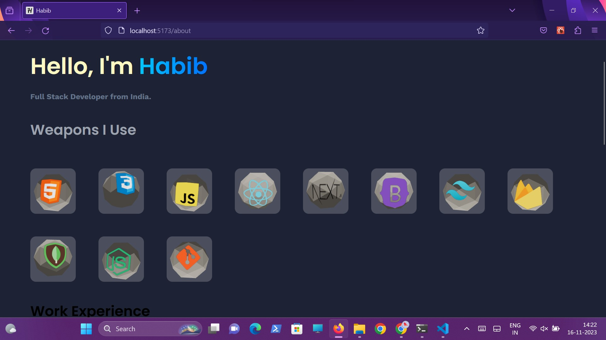
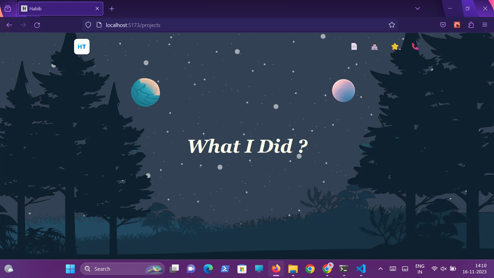
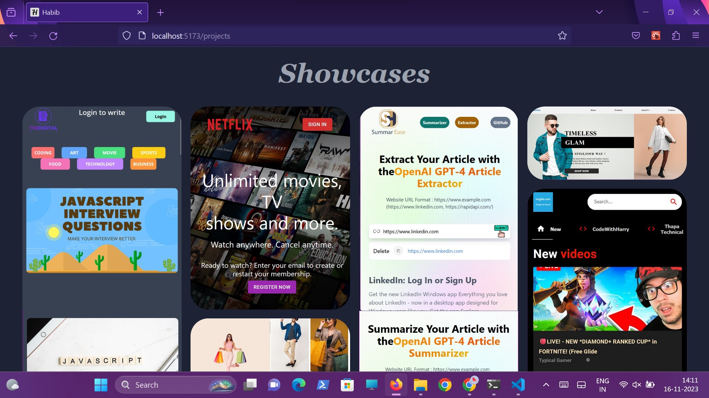
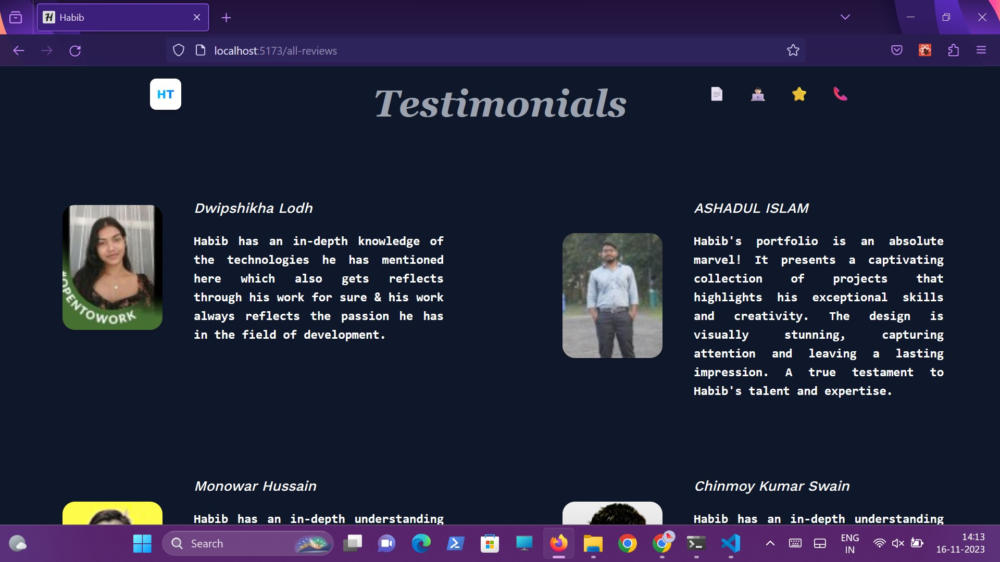
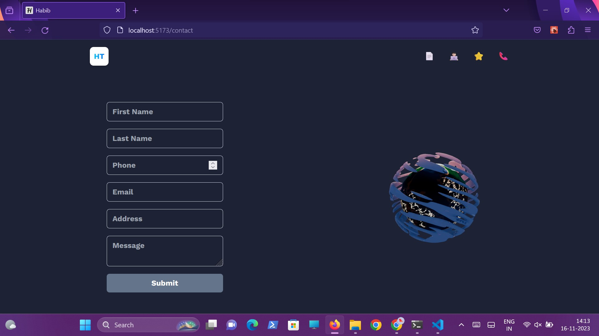

# My Portfolio








## Table of Contents
- [My Portfolio](#my-portfolio)
  - [Table of Contents](#table-of-contents)
  - [Description](#description)
  - [Features](#features)
  - [Technologies Used](#technologies-used)
  - [Getting Started](#getting-started)

## Description

Welcome to my personal portfolio! This project showcases my skills and projects using React, Tailwind CSS, and Three.js. The design is inspired by JS Mastery, and I've incorporated interactive three-dimensional elements to enhance the user experience.

## Features

- Interactive three-dimensional elements using Three.js.
- Responsive design with Tailwind CSS.
- React-based components for a seamless user experience.

## Technologies Used

- React
- Tailwind CSS
- Three.js
- Firebase

## Getting Started

To run this project locally, follow these steps:

```bash
git clone git@github.com:Habib7442/threejs-portfolio.git
npm install
npm run dev
